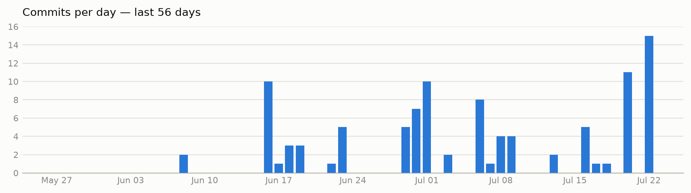

# TieTech Innovations

_One-line mission statement goes here._

[Website](https://tietech.co) · [GitHub](https://github.com/TieTechInnovations) · [Contact](mailto:hello@tietech.co)

---

## About

<!-- TODO: 2-4 sentence company blurb — what you build, who it's for, what makes it different. -->

Placeholder: TieTech Innovations builds ___. We focus on ___ for ___.

## What we work with

<!-- TODO: trim/edit to your actual stack -->

`TypeScript` · `Python` · `Go` · `React` · `Node.js` · `PostgreSQL` · `AWS`

## Team

<!-- TODO: list founders/leads and links, or link to a team page -->

| Name | Role | Links |
|---|---|---|
| Placeholder | Placeholder | [GitHub](#) |

---

## 📊 Commit activity

<!-- STATS:START -->
In the last 56 days: **101** commits across **7/51** active repos (**50** private).

<picture>
  <source media="(prefers-color-scheme: dark)" srcset="assets/commit-graph-dark.png">
  
</picture>

**Most active repos**

- `ledger-pro-backend` — 30 commits
- `staff_complaint_mobile` — 21 commits
- `user_complaint_mobile` — 16 commits
- `.github` — 15 commits
- `ledger-pro` — 8 commits

**Top contributors**

- majidimtiaz3 — 51 commits
- abdullahumar2002 — 27 commits
- ZainMustafaaa — 13 commits
- sanaejaz — 8 commits
- github-actions[bot] — 2 commits

**Primary languages**: `JavaScript`, `TypeScript`, `Python`, `Solidity`, `Kotlin`
<!-- STATS:END -->

Last updated: 2026-07-22 22:37 UTC

